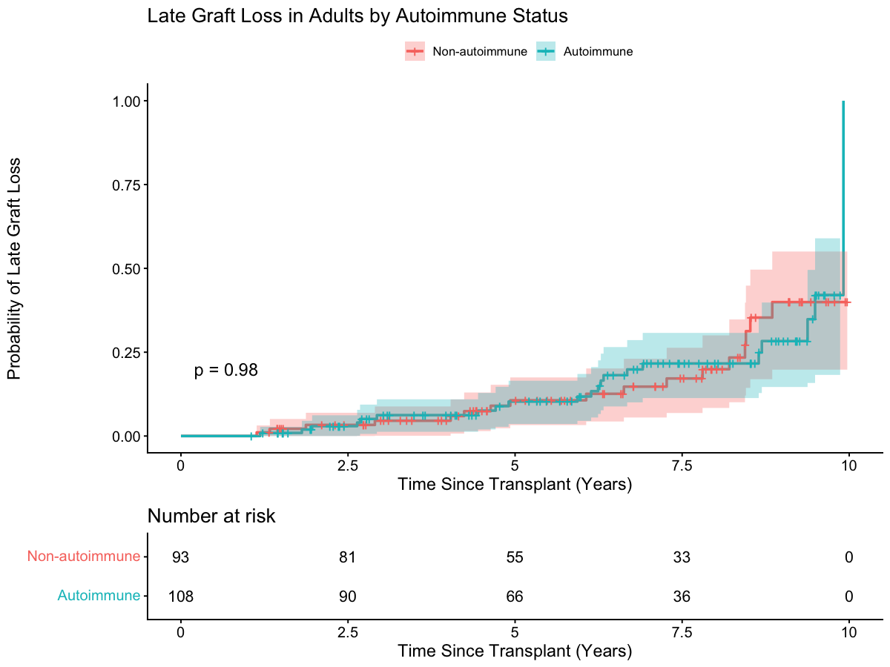

# Liver Transplant Outcomes: R Survival Analysis Workflow

## Overview

This project demonstrates an R-based workflow for preparing liver transplant data and conducting survival analysis.

The project is based on a clinical outcomes research workflow involving national liver transplant registry data. The analysis includes building an analytic cohort, creating derived variables, performing data quality checks, generating descriptive statistics, and conducting survival analyses.

This public portfolio version uses synthetic data so the analytical workflow can be demonstrated without sharing restricted clinical data.

## Research Question

The original research examined whether autoimmune liver disease was associated with long-term graft outcomes following liver retransplantation and whether outcomes differed across autoimmune disease subtypes.

## Data

This repository contains a fully synthetic dataset with 250 fictional patient records created solely for portfolio demonstration.

The synthetic dataset includes variables representing:

- Patient demographics
- Transplant dates
- Autoimmune disease groups
- BMI
- Diabetes
- Dialysis
- Simultaneous liver-kidney transplant status
- Follow-up time
- Late graft loss

No real patient-level or restricted clinical data are included in this repository.

## Analytical Workflow

1. Import and prepare the data
2. Build the analytic cohort using inclusion and exclusion criteria
3. Create derived variables
4. Perform data quality checks
5. Generate descriptive statistics
6. Conduct Kaplan-Meier survival analysis
7. Perform Cox proportional hazards regression
8. Present the results

## Statistical Methods

- Descriptive statistics
- Kaplan-Meier survival analysis
- Log-rank test
- Cox proportional hazards regression

## Example Output

The Kaplan-Meier analysis below demonstrates the cumulative probability of late graft loss among adult patients in the synthetic dataset, stratified by autoimmune status.

> **Note:** This visualization is based entirely on synthetic data created for portfolio demonstration purposes and does not represent actual patient outcomes.

## Programming & Packages

- R
- `dplyr`
- `survival`
- `survminer`
- `gtsummary`

## Skills Demonstrated

- Healthcare data preparation
- Analytic cohort development
- Inclusion and exclusion criteria
- Data cleaning and validation
- Derived variable creation
- Descriptive statistics
- Survival analysis
- Statistical modeling
- Data visualization
- Reproducible analytical workflows

## How to Run This Project

1. Download or clone this repository.
2. Open the project folder in RStudio.
3. Make sure the `data` folder is located in the project directory.
4. Open `R/liver_transplant_analysis.R`.
5. Run the script from beginning to end.

The script uses the synthetic dataset included in the `data` folder.

## Project Notes

The original research project used restricted clinical registry data. The original dataset and patient-level information are not included in this repository.

The synthetic dataset included here was created specifically to demonstrate the general data preparation and statistical analysis workflow used in the project.
